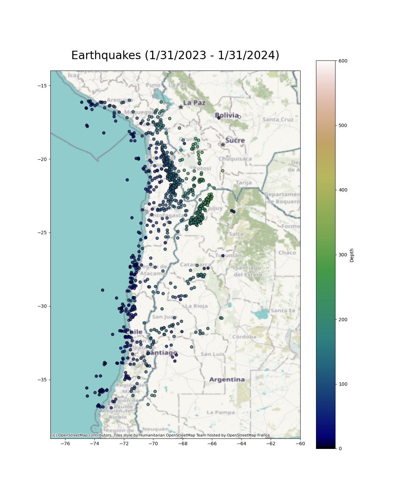
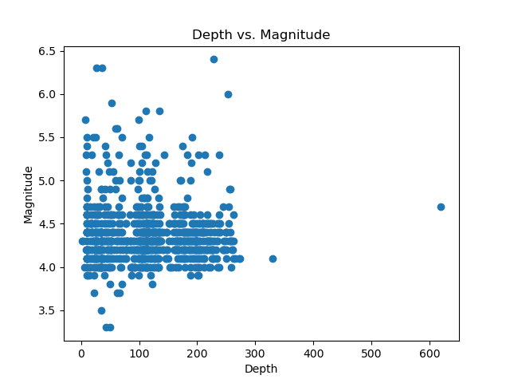
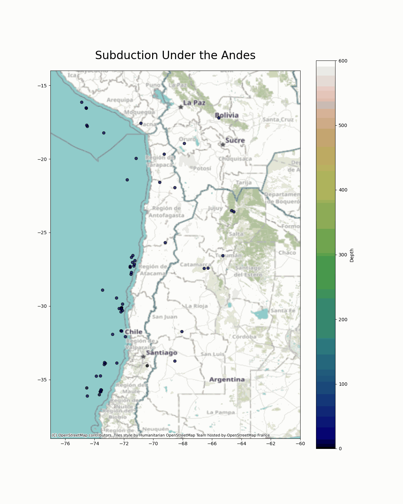

# Earthquakes in the Andes
Students from the Roux Institute DS5010 course temporarily collaborated on analyzing earthquake data through USGS API requests back in early 2024. This project involved completing and polishing the unfinished work, then creating a GitHub pages site to display the earthquake data near the South American West Coast. The data should provide visual evidence of the pacific plate subducting under the Andes.
<details>
  <summary>DEPENDENCIES (also see environment.yml)</summary>
  <ul>
    <li>Python 3.7+</li>
    <li>Requests</li>
    <li>GNU Make</li>
    <li>Pandas</li>
    <li>Geopandas</li>
    <li>Contextily</li>
    <li>ImageIO</li>
  </ul>
</details>

## Instructions for Use
### *Step 1: Generate Data*
After cloning and downloading the repository, enter the same directory with the terminal. You can request and download any necessary data by using the following command in your terminal:
```
make data
```
Doing this will download a years worth of earthquake data (1/31/2023-1/31/2024) from the USGS API in chunks, and then merge all of those files into a single file that should appear in a merged_data file. Start/end dates along with longitude/latitude coordinates are also customizable.

### *Step 2: Generate Static Images*
To create the static visualizations of the data, enter the following command in the terminal:
```
make figures
```
Doing so should generate static images of all the earthquakes near the Andes from 1/31/2023-1/31/2024, showing up in the figs folder. A merged version of the image should appear as `merged_graph.png` and look something like following figure:

<p align="center">
    
</p><br>

A graphic image of the depths and magnitudes of those earthquakes will also be created under `mag_depth.png`.

<p align="center">
    
</p><br>

### *Step 3: Generate the GIF*
To create the GIF visualization of the data, enter the following command in the terminal:
```
make gif
```
Doing so should generate a GIF of the static images set based on depth in the figs folder under `combined.gif`.
<p align="center">
    
</p><br>

### *See website for more (TBD):*
A GitHub-pages site has been created. You can read more about this data in the URL provided [here](-insert URL-)


## References:
<details>
  <summary>Documentation Sources</summary>
  <ul>
    <li>Python <a href="https://www.python.org/downloads/">here</a></li>
    <li>Requests <a href="https://pypi.org/project/requests/">here</a></li>
    <li>GNU Make <a href="https://www.gnu.org/software/make/manual/make.html">here</a></li>
    <li>Pandas <a href="https://pandas.pydata.org">here</a></li>
    <li>Geopandas <a href="https://geopandas.org/en/stable/">here</a></li>
    <li>Contextily <a href="https://pypi.org/project/contextily/">here</a> and <a href="https://contextily.readthedocs.io/en/latest/">here</a></li>
    <li>ImageIO <a href="https://pypi.org/project/imageio/">here</a> and <a href="https://imageio.readthedocs.io/en/stable/">here</a></li>
    <li>USGS API Documentation <a href="https://earthquake.usgs.gov/fdsnws/event/1/">here</a></li>
  </ul>
</details>
<details>
<summary>Online Sources</summary>
  <ul>
    <li>tbd</li>
  </ul>
</details>
<details>
<summary>Human Resources</summary>
  <ul>
    <li>tbd</li>
  </ul>
</details>